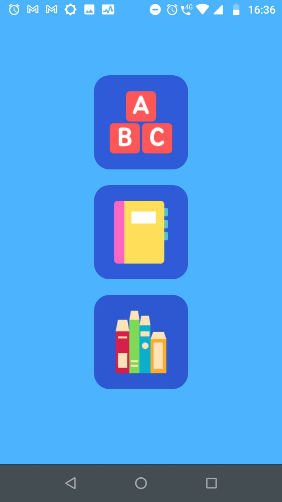
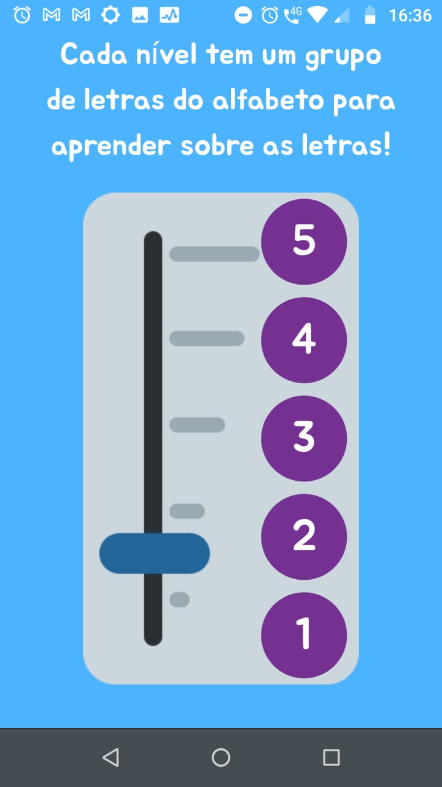
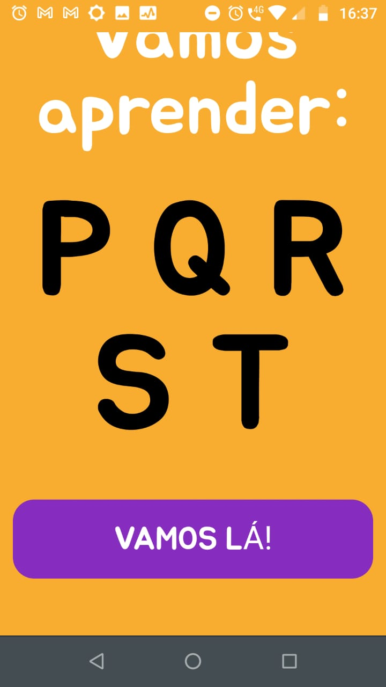
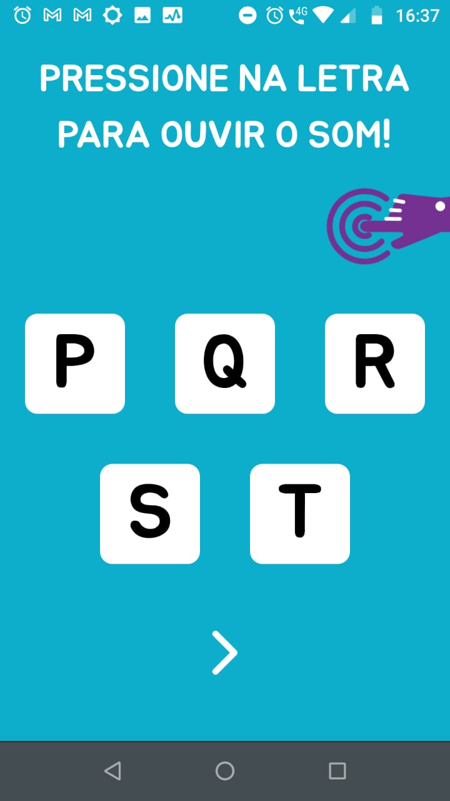
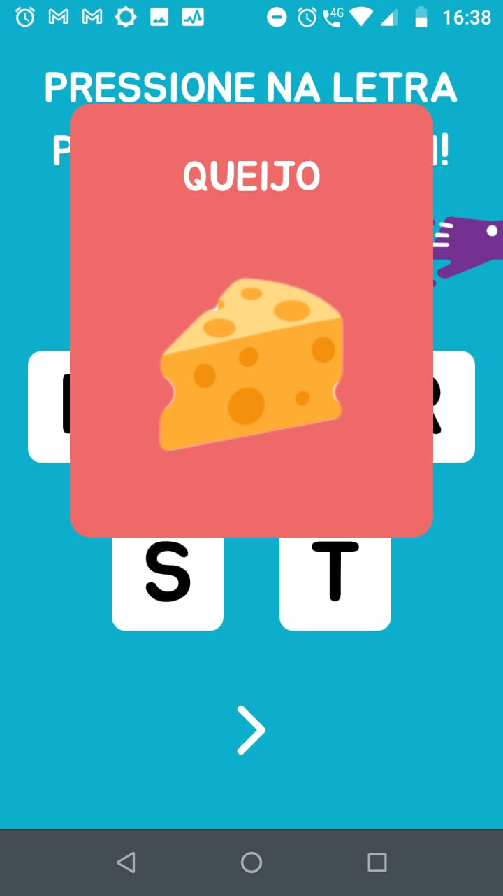
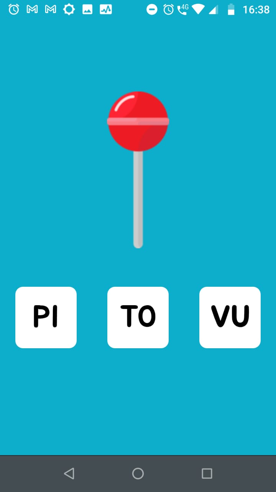

<h1 align="center">Blue Angel</h1>

<p align="center">
  
</p>

<ul>
  <li><a href="#description">Description</a></br></li>
  <li><a href="#How%20to%20Download">How to Download</a></br></li>
  <li><a href="#functionalities">Functionalities</a></br></li>
  <li><a href="#Clone%20project">Clone project</a></br></li>
</ul>

<br />

## **Description**

This work presents the development of an application that seeks to make the practice of literacy of autistic children with learning difficulties feasible. The project aims to help children with autism, through a mobile app, in the first school steps, when they may have more difficulties, due to the limitations that Autism Spectrum Disorder can offer. It is hoped that, through application, children will be able to fully develop in their literacy.

## **How to Download**

You can download the app by clicking on the 
<a href="https://drive.google.com/file/d/16dTsSlY014ofuW-9J-gsUD2vFwFWCQEd/view?usp=drivesdk" target="_blank">this link</a>.


## **Functionalities**

- The user can choose on of 3 phases:
- The user can choose from the level options in each phase.
- Each level is completed when the user correctly answers the question asked.
- When a level is completed, the system returns to the main menu screen.
- Attention: In exercises the child is always assisted with a voice feature.


<p align="center">
  
  
  
  
  
  
</p>

## **Clone project**

```BASH
$ git clone git@github.com:roavellarm/blue-angel.git
# or
$ git clone https://github.com/roavellarm/blue-angel.git
```

- Access folder

```BASH
$ cd blue-angel
```

- Install dependencies

```BASH
$ yarn
```

- Run project

```BASH
$ yarn start
```

## **Authors:**
- **Natália Bruce** - _conception, design_
- **Thiilyn Niksan** - _conception, design, development_
- **Rodrigo Avellar** - _development_